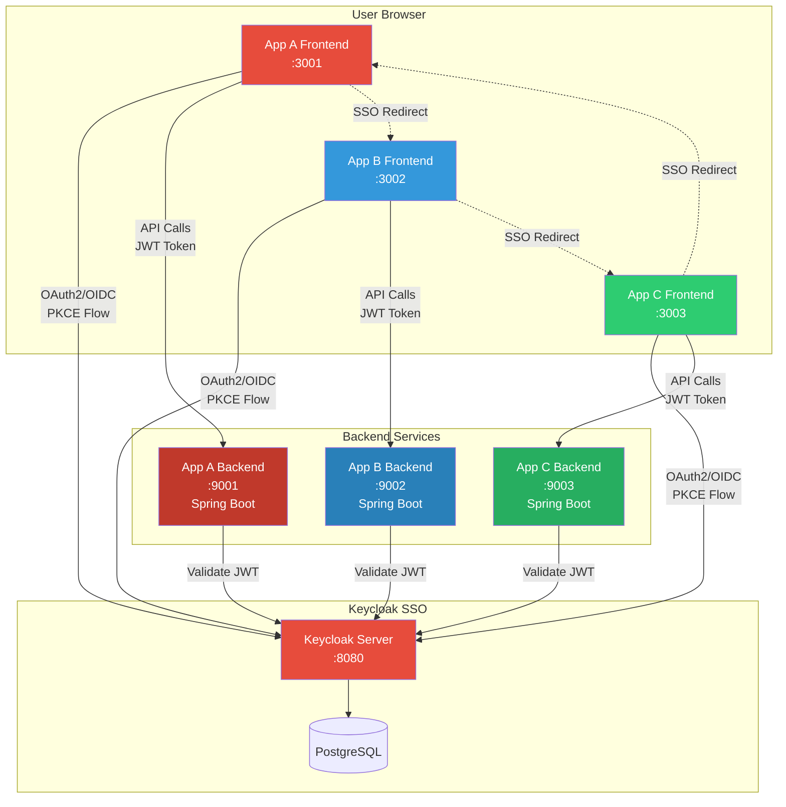
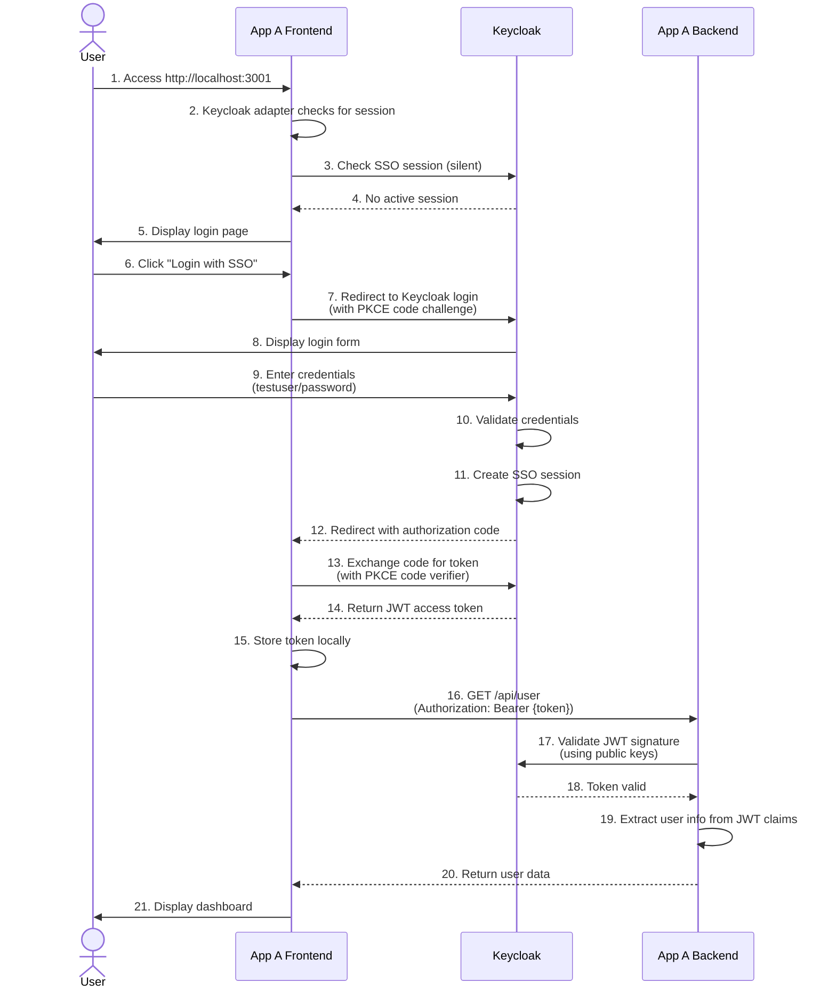
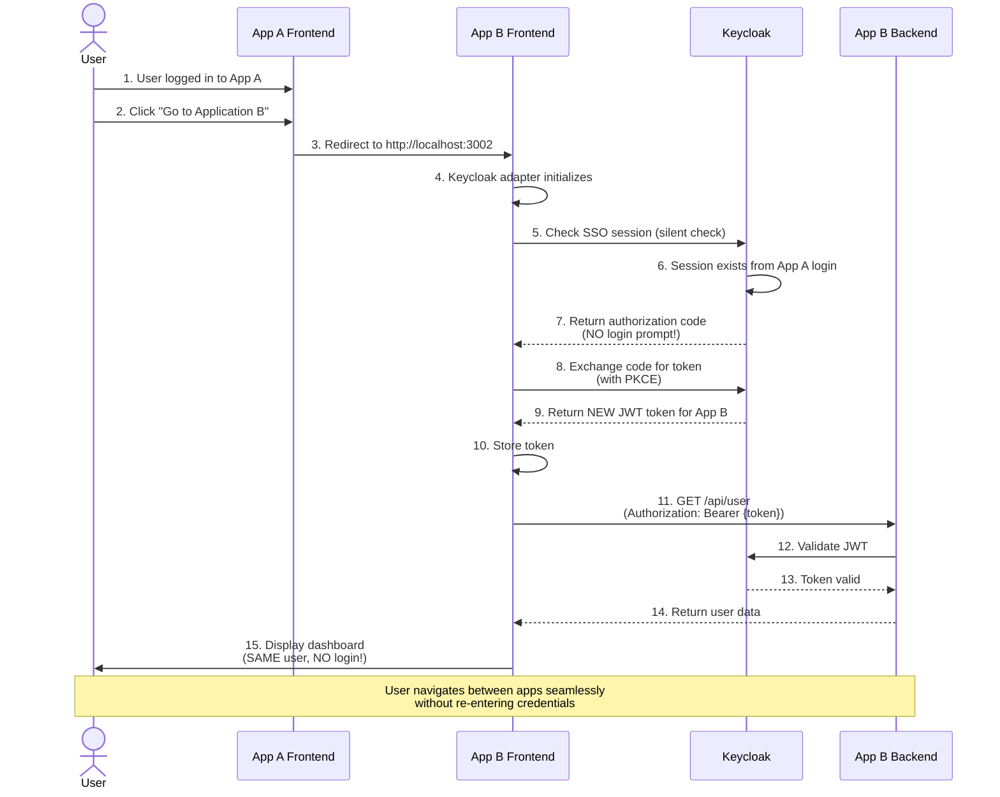
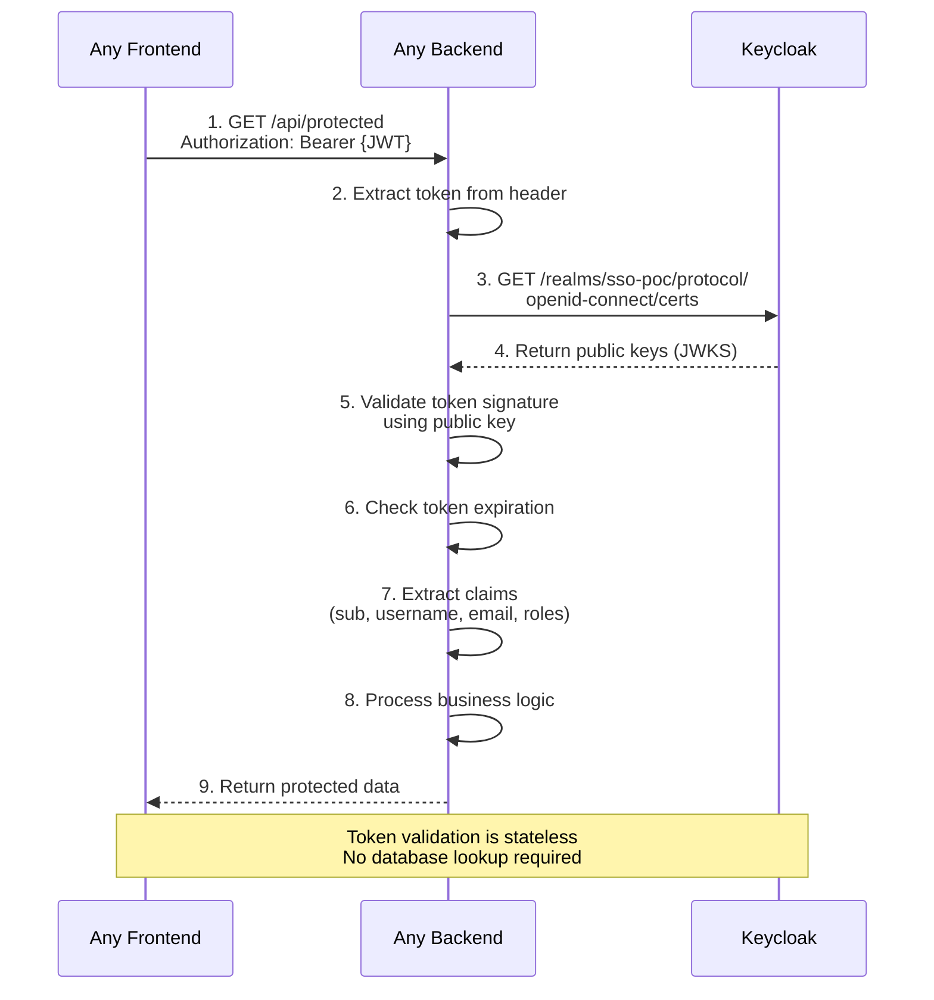
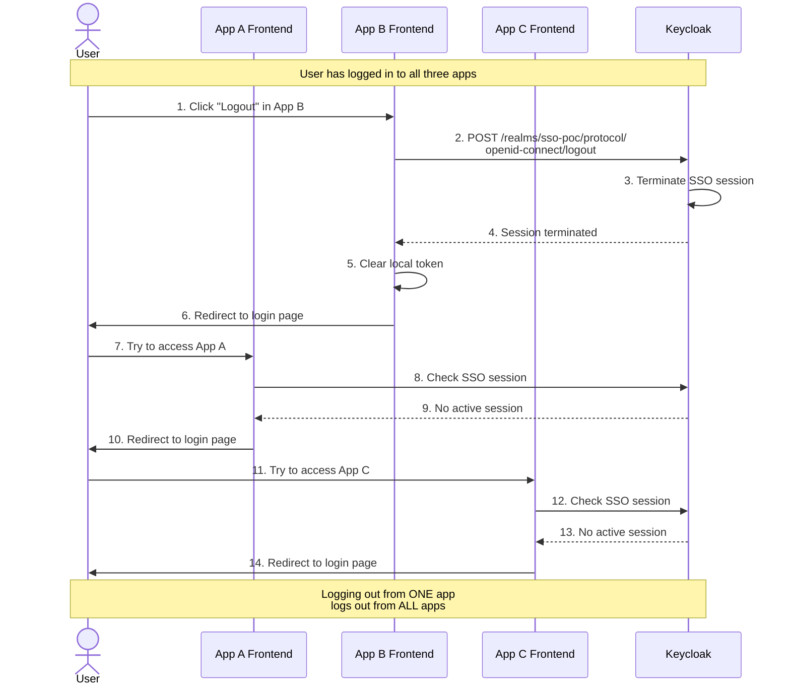
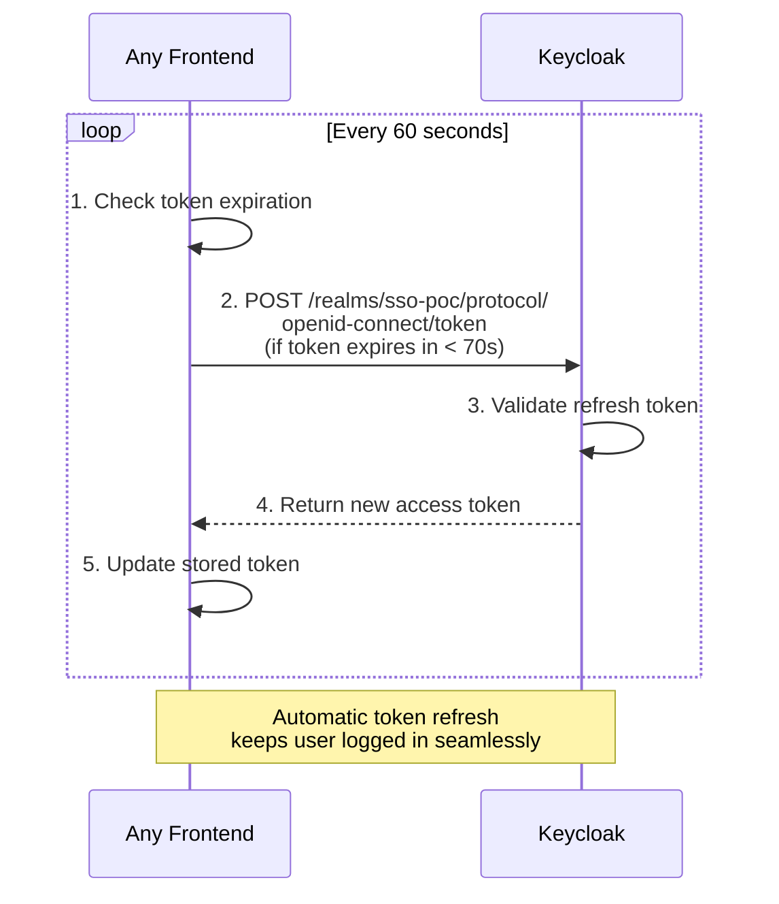

# SSO POC with Keycloak - Three Application Demo

This proof of concept demonstrates Single Sign-On (SSO) across three independent applications using Keycloak as the identity provider. Each application consists of a Spring Boot backend (Java 25, Hexagonal Architecture) and a React frontend.

## Architecture Overview

### System Architecture Diagram



### Technology Stack
- **SSO Provider**: Keycloak 23.0 (containerized with PostgreSQL)
- **Backend**: Spring Boot 4.0.1 with Java 25 (Hexagonal Architecture, no Lombok - pure Java)
- **Frontend**: React 18.2 with TypeScript 4.9.5 (Hexagonal Architecture)
- **Authentication**: OAuth2/OIDC with PKCE

### Applications
1. **Application A** - Healthcare Management System
   - Frontend: http://localhost:3001
   - Backend: http://localhost:9001

2. **Application B** - Financial Services Platform
   - Frontend: http://localhost:3002
   - Backend: http://localhost:9002

3. **Application C** - Supply Chain Management
   - Frontend: http://localhost:3003
   - Backend: http://localhost:9003

### Keycloak
- Admin Console: http://localhost:8080
- Admin credentials: `admin` / `admin`
- Realm: `sso-poc`

## Architecture Principles

### Backend - Hexagonal Architecture
Each Spring Boot backend follows hexagonal (ports & adapters) architecture:

```
src/main/java/com/example/sso/app[a|b|c]/
├── domain/                      # Business logic layer
│   └── model/                   # Domain entities
├── application/                 # Application layer
│   ├── port/
│   │   ├── in/                  # Input ports (use cases)
│   │   └── out/                 # Output ports (interfaces)
│   └── service/                 # Application services
└── infrastructure/              # Infrastructure layer
    ├── adapter/
    │   ├── in/
    │   │   └── web/             # REST controllers
    │   └── out/
    │       └── security/        # Keycloak integration
    └── config/                  # Spring configuration
```

### Frontend - Hexagonal Architecture
Each React frontend follows hexagonal architecture principles:

```
src/
├── domain/                      # Domain models/types
├── adapters/                    # Infrastructure adapters
│   ├── KeycloakAdapter.ts      # Keycloak integration
│   └── ApiAdapter.ts           # Backend API client
├── useCases/                    # Application logic (custom hooks)
└── ui/                          # Presentation layer
    ├── components/              # Reusable UI components
    └── pages/                   # Page components
```

## Prerequisites

- **Docker & Docker Compose** (for Keycloak)
- **Java 25** (for Spring Boot backends - pure Java, no Lombok required)
- **Maven 3.8+** (for building Spring Boot apps)
- **Node.js 18+** and **npm** (for React frontends)

## Setup Instructions

### 1. Start Keycloak

```bash
# From the project root directory
docker-compose up -d

# Wait for Keycloak to be ready (check logs)
docker-compose logs -f keycloak
```

Wait until you see: "Keycloak started in X.XXXs"

### 2. Import Keycloak Realm Configuration

Once Keycloak is running, import the realm configuration:

```bash
# Make the script executable
chmod +x keycloak-config/import-realm.sh

# Import the realm (requires jq to be installed)
# If jq is not installed: brew install jq (macOS) or apt-get install jq (Linux)
./keycloak-config/import-realm.sh
```

Alternatively, you can import manually:
1. Open http://localhost:8080
2. Login with `admin` / `admin`
3. Click "Create Realm"
4. Click "Browse" and select `keycloak-config/realm-export.json`
5. Click "Create"

### 3. Start Backend Applications

Open three separate terminal windows and run each backend:

#### Terminal 1 - App A Backend
```bash
cd app-a-backend
mvn clean install
mvn spring-boot:run
```

#### Terminal 2 - App B Backend
```bash
cd app-b-backend
mvn clean install
mvn spring-boot:run
```

#### Terminal 3 - App C Backend
```bash
cd app-c-backend
mvn clean install
mvn spring-boot:run
```

Wait for all backends to start. You should see "Started App[A|B|C]Application" in each terminal.

### 4. Start Frontend Applications

Open three more terminal windows and run each frontend:

#### Terminal 4 - App A Frontend
```bash
cd app-a-frontend
npm install
npm start
```

#### Terminal 5 - App B Frontend
```bash
cd app-b-frontend
npm install
npm start
```

#### Terminal 6 - App C Frontend
```bash
cd app-c-frontend
npm install
npm start
```

All frontends should automatically open in your browser. If not, manually navigate to:
- App A: http://localhost:3001
- App B: http://localhost:3002
- App C: http://localhost:3003

## Testing the SSO Flow

### Test Credentials
- **Username**: `testuser`
- **Password**: `password`

or

- **Username**: `admin`
- **Password**: `admin`

### SSO Test Scenarios

#### Scenario 1: Login and Navigate Between Apps
1. Open http://localhost:3001 (App A)
2. Click "Login with SSO"
3. Enter credentials: `testuser` / `password`
4. You'll be redirected back to App A dashboard
5. On the dashboard, click "Go to Application B"
6. **Notice**: You are NOT asked to login again - this is SSO in action!
7. From App B, click "Go to Application C"
8. **Notice**: Again, no login required
9. Navigate back to App A or B - still no login required

#### Scenario 2: Verify User Information Sharing
1. Login to any application
2. Check the "User Profile" section
3. Navigate to another application
4. **Notice**: The same user information is displayed
5. All applications share the same authentication session

#### Scenario 3: Single Logout
1. Login to all three applications by navigating between them
2. From any application, click "Logout"
3. Try to access any of the other applications
4. **Notice**: You are logged out from all applications simultaneously

#### Scenario 4: Token Validation
1. Open browser Developer Tools (F12)
2. Go to Network tab
3. Login to App A
4. Navigate to App B
5. Check the network requests to the backend
6. **Notice**: The same JWT token is being sent to all backends
7. All backends validate the token against the same Keycloak realm

## Project Structure

```
poc-sso/
├── docker-compose.yml                 # Keycloak & PostgreSQL setup
├── keycloak-config/
│   ├── realm-export.json             # Pre-configured realm with 3 clients
│   └── import-realm.sh               # Automated realm import script
├── app-a-backend/                    # Spring Boot backend for App A
│   └── src/main/java/.../appa/
│       ├── domain/                   # Business logic
│       ├── application/              # Use cases & ports
│       └── infrastructure/           # Adapters & config
├── app-b-backend/                    # Spring Boot backend for App B
├── app-c-backend/                    # Spring Boot backend for App C
├── app-a-frontend/                   # React frontend for App A
│   └── src/
│       ├── domain/                   # Domain models
│       ├── adapters/                 # Keycloak & API adapters
│       ├── useCases/                 # Custom hooks
│       └── ui/                       # Components & pages
├── app-b-frontend/                   # React frontend for App B
├── app-c-frontend/                   # React frontend for App C
└── README.md
```

## How SSO Works in This POC

### Flow Diagrams

#### 1. Initial Login Flow (First Time User Access)



#### 2. SSO Flow (Navigate to Another App Without Re-login)



#### 3. Token Validation Flow (Backend API Call)



#### 4. Single Logout Flow



#### 5. Token Refresh Flow



### Authentication Flow

1. **Initial Login (App A)**:
   - User accesses App A frontend
   - Keycloak adapter checks for existing session (check-sso)
   - No session found → redirects to Keycloak login page
   - User enters credentials
   - Keycloak validates credentials
   - Keycloak creates session and issues JWT token
   - User is redirected back to App A with authorization code
   - App A exchanges code for token using PKCE
   - App A stores token and displays dashboard

2. **Navigation to App B (No Re-login)**:
   - User clicks "Go to Application B"
   - Browser redirects to http://localhost:3002
   - App B's Keycloak adapter checks for existing session
   - **Keycloak session exists** → automatically issues new token for App B
   - App B receives token without user interaction
   - App B displays dashboard with same user info

3. **Token Validation**:
   - Each frontend sends JWT token to its backend in Authorization header
   - Backend validates token signature using Keycloak's public keys
   - Backend extracts user information from token claims
   - No database lookup required for authentication

4. **Single Logout**:
   - User clicks "Logout" in any app
   - App calls Keycloak logout endpoint
   - Keycloak terminates the session
   - All applications lose authentication

### Key Components

#### Frontend (React)
- **KeycloakAdapter**: Handles authentication, token management, and session refresh
- **ApiAdapter**: Makes authenticated requests to backend with JWT token
- **useAuth Hook**: Manages authentication state
- **useAppData Hook**: Fetches user and app data from backend

#### Backend (Spring Boot)
- **SecurityConfig**: Configures OAuth2 resource server with JWT validation
- **KeycloakAuthenticationAdapter**: Validates tokens and extracts user info
- **UserController**: Protected endpoints requiring valid JWT

## Troubleshooting

### Keycloak Not Starting
```bash
# Check logs
docker-compose logs keycloak

# Restart containers
docker-compose down
docker-compose up -d
```

### Backend Fails to Start
- Ensure Java 25 is installed: `java -version`
- Check if ports 9001, 9002, 9003 are available
- Check backend logs for specific errors

### Frontend Fails to Start
- Ensure Node.js is installed: `node -v`
- Check if ports 3001, 3002, 3003 are available
- Clear npm cache: `npm cache clean --force`
- Delete node_modules and reinstall: `rm -rf node_modules && npm install`

### SSO Not Working
- Clear browser cookies for localhost
- Check Keycloak is running: http://localhost:8080
- Verify realm `sso-poc` exists in Keycloak
- Check browser console for errors (F12 → Console)
- Verify backend can reach Keycloak (check backend logs)

### CORS Errors
- Ensure backends are configured with correct CORS origins
- Check that frontend is accessing the correct backend URL
- Verify `.env` files in each frontend have correct values

## Security Notes

This is a POC for demonstration purposes. For production use, consider:

1. **HTTPS**: Use SSL/TLS for all connections
2. **Secret Management**: Store secrets in vault, not in code
3. **Token Storage**: Consider secure storage mechanisms
4. **CORS**: Restrict CORS to specific domains
5. **Session Management**: Configure appropriate session timeouts
6. **Keycloak**: Use production-grade database and configuration
7. **Rate Limiting**: Add rate limiting to prevent abuse
8. **Security Headers**: Add security headers to all responses

## Stopping the POC

```bash
# Stop frontends: Press Ctrl+C in each terminal

# Stop backends: Press Ctrl+C in each terminal

# Stop Keycloak
docker-compose down

# To remove volumes (will delete all Keycloak data)
docker-compose down -v
```

## Next Steps

To extend this POC, consider:

1. **Add Role-Based Access Control (RBAC)**
   - Different endpoints for different roles
   - UI elements conditional on roles

2. **Implement Refresh Token Rotation**
   - Enhanced security for token management

3. **Add Social Login**
   - Google, GitHub, Facebook integration in Keycloak

4. **Multi-Factor Authentication**
   - Enable MFA in Keycloak

5. **Monitoring & Logging**
   - Add centralized logging
   - Add metrics and monitoring

6. **API Gateway**
   - Introduce API Gateway pattern
   - Centralized authentication/authorization

## License

This is a proof of concept for educational purposes.
