# SSO POC with Keycloak - Three Application Demo

This proof of concept demonstrates Single Sign-On (SSO) and Role-Based Access Control (RBAC) across three independent applications using Keycloak as the identity provider. Each application consists of a Spring Boot backend (Java 25, Hexagonal Architecture) and a React frontend.


## Architecture Overview

### System Architecture Diagram


### Technology Stack
- **SSO Provider**: Keycloak 23.0 (containerized with PostgreSQL)
- **Backend**: Spring Boot 4.0.1 with Java 25 (Hexagonal Architecture, no Lombok - pure Java)
- **Frontend**: React 18.2 with TypeScript 4.9.5 (Hexagonal Architecture)
- **Authentication**: OAuth2/OIDC with PKCE

### Applications
1. **Application A** - Healthcare Management System
   - Frontend: http://localhost:3001
   - Backend: http://localhost:9001

2. **Application B** - Financial Services Platform
   - Frontend: http://localhost:3002
   - Backend: http://localhost:9002

3. **Application C** - Supply Chain Management
   - Frontend: http://localhost:3003
   - Backend: http://localhost:9003

### Keycloak
- Admin Console: http://localhost:8080
- Admin credentials: `admin` / `admin`
- Realm: `sso-poc`

## Architecture Principles

### Backend - Hexagonal Architecture
Each Spring Boot backend follows hexagonal (ports & adapters) architecture:

```
src/main/java/com/example/sso/app[a|b|c]/
├── domain/                      # Business logic layer
│   └── model/                   # Domain entities
├── application/                 # Application layer
│   ├── port/
│   │   ├── in/                  # Input ports (use cases)
│   │   └── out/                 # Output ports (interfaces)
│   └── service/                 # Application services
└── infrastructure/              # Infrastructure layer
    ├── adapter/
    │   ├── in/
    │   │   └── web/             # REST controllers
    │   └── out/
    │       └── security/        # Keycloak integration
    └── config/                  # Spring configuration
```

### Frontend - Hexagonal Architecture
Each React frontend follows hexagonal architecture principles:

```
src/
├── domain/                      # Domain models/types
├── adapters/                    # Infrastructure adapters
│   ├── KeycloakAdapter.ts      # Keycloak integration
│   └── ApiAdapter.ts           # Backend API client
├── useCases/                    # Application logic (custom hooks)
└── ui/                          # Presentation layer
    ├── components/              # Reusable UI components
    └── pages/                   # Page components
```

## Prerequisites

- **Docker & Docker Compose** (for Keycloak)
- **Java 25** (for Spring Boot backends - pure Java, no Lombok required)
- **Maven 3.8+** (for building Spring Boot apps)
- **Node.js 18+** and **npm** (for React frontends)

## Setup Instructions

### Quick Start (Automated)

The easiest way to start the entire POC:

```bash
# Make the script executable
chmod +x start-all.sh

# Start everything (Keycloak, backends, frontends, RBAC setup)
./start-all.sh
```

This script will:
1. Start Keycloak with Docker Compose
2. Import the realm configuration
3. Set up RBAC (roles and test users)
4. Build and start all three Spring Boot backends
5. Install dependencies and start all three React frontends

All logs are saved in the `logs/` directory.

To stop everything:
```bash
./stop-all.sh
```

### Manual Setup (Step by Step)

If you prefer to start components individually:

#### 1. Start Keycloak

```bash
# From the project root directory
docker-compose up -d

# Wait for Keycloak to be ready (check logs)
docker-compose logs -f keycloak
```

Wait until you see: "Keycloak started in X.XXXs"

### 2. Import Keycloak Realm Configuration

Once Keycloak is running, import the realm configuration:

```bash
# Make the script executable
chmod +x keycloak-config/import-realm.sh

# Import the realm (requires jq to be installed)
# If jq is not installed: brew install jq (macOS) or apt-get install jq (Linux)
./keycloak-config/import-realm.sh
```

Alternatively, you can import manually:
1. Open http://localhost:8080
2. Login with `admin` / `admin`
3. Click "Create Realm"
4. Click "Browse" and select `keycloak-config/realm-export.json`
5. Click "Create"

#### 3. Set Up RBAC (Roles and Users)

Configure role-based access control:

```bash
# Make the script executable
chmod +x setup-rbac.sh

# Create roles and users
./setup-rbac.sh
```

This creates:
- Application-specific roles: `app-a-user`, `app-b-user`, `app-c-user`
- User Bob (`bob`/`bob123`) with access to App A only
- Updates testuser with access to all apps

#### 4. Start Backend Applications

Open three separate terminal windows and run each backend:

#### Terminal 1 - App A Backend
```bash
cd app-a-backend
mvn clean install
mvn spring-boot:run
```

#### Terminal 2 - App B Backend
```bash
cd app-b-backend
mvn clean install
mvn spring-boot:run
```

#### Terminal 3 - App C Backend
```bash
cd app-c-backend
mvn clean install
mvn spring-boot:run
```

Wait for all backends to start. You should see "Started App[A|B|C]Application" in each terminal.

#### 5. Start Frontend Applications

Open three more terminal windows and run each frontend:

#### Terminal 4 - App A Frontend
```bash
cd app-a-frontend
npm install
npm start
```

#### Terminal 5 - App B Frontend
```bash
cd app-b-frontend
npm install
npm start
```

#### Terminal 6 - App C Frontend
```bash
cd app-c-frontend
npm install
npm start
```

All frontends should automatically open in your browser. If not, manually navigate to:
- App A: http://localhost:3001
- App B: http://localhost:3002
- App C: http://localhost:3003

## Testing the SSO and RBAC

### Test Credentials

**Full Access (All Applications)**
- **Username**: `testuser`
- **Password**: `password`
- **Roles**: `app-a-user`, `app-b-user`, `app-c-user`
- **Access**: ✅ App A, ✅ App B, ✅ App C

**Limited Access (Application A Only)**
- **Username**: `bob`
- **Password**: `bob123`
- **Roles**: `app-a-user`
- **Access**: ✅ App A, ❌ App B (Access Denied), ❌ App C (Access Denied)

**Admin**
- **Username**: `admin`
- **Password**: `admin`
- **Roles**: `admin`, `user`

### SSO Test Scenarios

#### Scenario 1: Login and Navigate Between Apps
1. Open http://localhost:3001 (App A)
2. Click "Login with SSO"
3. Enter credentials: `testuser` / `password`
4. You'll be redirected back to App A dashboard
5. On the dashboard, click "Go to Application B"
6. **Notice**: You are NOT asked to login again - this is SSO in action!
7. From App B, click "Go to Application C"
8. **Notice**: Again, no login required
9. Navigate back to App A or B - still no login required

#### Scenario 2: Verify User Information Sharing
1. Login to any application
2. Check the "User Profile" section
3. Navigate to another application
4. **Notice**: The same user information is displayed
5. All applications share the same authentication session

#### Scenario 3: Single Logout
1. Login to all three applications by navigating between them
2. From any application, click "Logout"
3. Try to access any of the other applications
4. **Notice**: You are logged out from all applications simultaneously

#### Scenario 4: Token Validation
1. Open browser Developer Tools (F12)
2. Go to Network tab
3. Login to App A
4. Navigate to App B
5. Check the network requests to the backend
6. **Notice**: The same JWT token is being sent to all backends
7. All backends validate the token against the same Keycloak realm

### RBAC Test Scenarios

#### Scenario 5: Bob's Limited Access (Access Denied)
1. Open http://localhost:3001 (App A)
2. Login with `bob` / `bob123`
3. **Notice**: Bob successfully logs in to App A
4. Click "Go to Application B"
5. **Notice**: Access Denied page appears with message: "Sorry **bob**, you don't have permission to access Application B"
6. Try navigating to http://localhost:3003 (App C)
7. **Notice**: Same Access Denied page for Application C
8. Bob can only access Application A

#### Scenario 6: Testuser's Full Access
1. Logout if currently logged in
2. Open http://localhost:3001 (App A)
3. Login with `testuser` / `password`
4. **Notice**: Testuser can access App A
5. Navigate to App B - **Success** ✅
6. Navigate to App C - **Success** ✅
7. Navigate back to App A - **Success** ✅
8. Testuser has full access to all applications

#### Scenario 7: Role-Based Authorization at API Level
1. Login as Bob to App A
2. Open browser Developer Tools (F12) → Network tab
3. Try to access App B
4. Check the network response from the backend
5. **Notice**: Backend returns `403 Forbidden` status
6. Frontend detects this and shows the Access Denied page
7. Authorization is enforced at the backend, not just the frontend

For more detailed RBAC testing scenarios, see [RBAC-TESTING.md](RBAC-TESTING.md).

## Project Structure

```
poc-sso/
├── docker-compose.yml                 # Keycloak & PostgreSQL setup
├── start-all.sh                       # Automated startup script (Keycloak + RBAC + Apps)
├── stop-all.sh                        # Stop all services script
├── setup-rbac.sh                      # RBAC configuration script (roles & users)
├── keycloak-config/
│   ├── realm-export.json             # Pre-configured realm with 3 clients
│   └── import-realm.sh               # Automated realm import script
├── app-a-backend/                    # Spring Boot backend for App A
│   └── src/main/java/.../appa/
│       ├── domain/                   # Business logic
│       ├── application/              # Use cases & ports
│       └── infrastructure/           # Adapters & config
│           └── config/
│               └── SecurityConfig.java  # RBAC enforcement (app-a-user role)
├── app-b-backend/                    # Spring Boot backend for App B
│   └── infrastructure/config/
│       └── SecurityConfig.java       # RBAC enforcement (app-b-user role)
├── app-c-backend/                    # Spring Boot backend for App C
│   └── infrastructure/config/
│       └── SecurityConfig.java       # RBAC enforcement (app-c-user role)
├── app-a-frontend/                   # React frontend for App A
│   └── src/
│       ├── domain/                   # Domain models
│       ├── adapters/                 # Keycloak & API adapters
│       ├── useCases/                 # Custom hooks
│       └── ui/                       # Components & pages
├── app-b-frontend/                   # React frontend for App B
│   └── src/ui/pages/
│       └── AccessDenied.tsx          # Access denied page for unauthorized users
├── app-c-frontend/                   # React frontend for App C
│   └── src/ui/pages/
│       └── AccessDenied.tsx          # Access denied page for unauthorized users
├── logs/                             # Application logs directory
├── README.md                         # This file
└── RBAC-TESTING.md                   # Detailed RBAC testing guide
```

## How SSO Works in This POC

### Flow Diagrams

#### 1. Initial Login Flow (First Time User Access)


#### 2. SSO Flow (Navigate to Another App Without Re-login)


#### 3. Token Validation Flow (Backend API Call)


#### 4. Single Logout Flow


#### 5. Token Refresh Flow


### Authentication Flow

1. **Initial Login (App A)**:
   - User accesses App A frontend
   - Keycloak adapter checks for existing session (check-sso)
   - No session found → redirects to Keycloak login page
   - User enters credentials
   - Keycloak validates credentials
   - Keycloak creates session and issues JWT token
   - User is redirected back to App A with authorization code
   - App A exchanges code for token using PKCE
   - App A stores token and displays dashboard

2. **Navigation to App B (No Re-login)**:
   - User clicks "Go to Application B"
   - Browser redirects to http://localhost:3002
   - App B's Keycloak adapter checks for existing session
   - **Keycloak session exists** → automatically issues new token for App B
   - App B receives token without user interaction
   - App B displays dashboard with same user info

3. **Token Validation**:
   - Each frontend sends JWT token to its backend in Authorization header
   - Backend validates token signature using Keycloak's public keys
   - Backend extracts user information from token claims
   - No database lookup required for authentication

4. **Single Logout**:
   - User clicks "Logout" in any app
   - App calls Keycloak logout endpoint
   - Keycloak terminates the session
   - All applications lose authentication

### Key Components

#### Frontend (React)
- **KeycloakAdapter**: Handles authentication, token management, and session refresh
- **ApiAdapter**: Makes authenticated requests to backend with JWT token, handles 403 errors
- **useAuth Hook**: Manages authentication state
- **useAppData Hook**: Fetches user and app data from backend, detects access denied
- **AccessDenied Component**: User-friendly page shown when user lacks required permissions

#### Backend (Spring Boot)
- **SecurityConfig**: Configures OAuth2 resource server with JWT validation and RBAC enforcement
  - App A requires `SCOPE_app-a-user` authority
  - App B requires `SCOPE_app-b-user` authority
  - App C requires `SCOPE_app-c-user` authority
- **JwtAuthenticationConverter**: Extracts roles from `realm_access.roles` claim in JWT
- **KeycloakAuthenticationAdapter**: Validates tokens and extracts user info
- **UserController**: Protected endpoints requiring valid JWT with appropriate roles

## How RBAC Works in This POC

### Authorization Architecture

```mermaid
sequenceDiagram
    actor User as User (Bob)
    participant AppA as App A Frontend
    participant AppB as App B Frontend
    participant BackendB as App B Backend
    participant KC as Keycloak

    Note over User,KC: Bob has app-a-user role only

    User->>AppA: 1. Login to App A
    AppA->>KC: 2. Authenticate
    KC->>KC: 3. Create JWT with roles:<br/>["app-a-user"]
    KC-->>AppA: 4. Return JWT token
    AppA->>User: 5. Show App A dashboard ✅

    User->>AppB: 6. Navigate to App B
    AppB->>AppB: 7. Check SSO session
    AppB->>KC: 8. Get token (silent)
    KC-->>AppB: 9. Return SAME JWT<br/>(roles: ["app-a-user"])
    AppB->>BackendB: 10. GET /api/user<br/>Authorization: Bearer {JWT}
    BackendB->>BackendB: 11. Validate JWT signature ✅
    BackendB->>BackendB: 12. Check authorities:<br/>Required: SCOPE_app-b-user<br/>Has: SCOPE_app-a-user
    BackendB->>BackendB: 13. Authorization FAILED ❌
    BackendB-->>AppB: 14. HTTP 403 Forbidden
    AppB->>AppB: 15. Detect 403 error
    AppB->>User: 16. Show Access Denied page 🚫
```



### RBAC Flow Explanation

1. **Role Assignment in Keycloak**:
   - Roles are created in Keycloak realm: `app-a-user`, `app-b-user`, `app-c-user`
   - Users are assigned roles based on their access needs
   - Bob gets only `app-a-user` role

2. **JWT Token Contains Roles**:
   ```json
   {
     "sub": "bob",
     "realm_access": {
       "roles": ["app-a-user"]
     }
   }
   ```

3. **Backend Extracts and Validates Roles**:
   - `JwtAuthenticationConverter` extracts roles from `realm_access.roles`
   - Converts them to Spring Security authorities with `SCOPE_` prefix
   - Spring Security checks if user has required authority

4. **Authorization Decision**:
   - ✅ Bob accessing App A: Has `SCOPE_app-a-user` → Access granted
   - ❌ Bob accessing App B: Missing `SCOPE_app-b-user` → 403 Forbidden
   - ❌ Bob accessing App C: Missing `SCOPE_app-c-user` → 403 Forbidden

5. **Frontend Response**:
   - Detects 403 status code from backend
   - Sets `accessDenied` state to true
   - Displays `AccessDenied` component with user's name and helpful message

### Security Implementation

**Backend (app-b-backend/src/.../infrastructure/config/SecurityConfig.java:47)**
```java
.anyRequest().hasAuthority("SCOPE_app-b-user")
```

**Frontend (app-b-frontend/src/adapters/ApiAdapter.ts:26)**
```typescript
if (response.status === 403) {
  throw new Error(`403: Access Denied`);
}
```

**Frontend (app-b-frontend/src/useCases/useAppData.ts:31)**
```typescript
if (err.message.includes('403')) {
  setAccessDenied(true);
}
```

## Troubleshooting

### Keycloak Not Starting
```bash
# Check logs
docker-compose logs keycloak

# Restart containers
docker-compose down
docker-compose up -d
```

### Backend Fails to Start
- Ensure Java 25 is installed: `java -version`
- Check if ports 9001, 9002, 9003 are available
- Check backend logs for specific errors

### Frontend Fails to Start
- Ensure Node.js is installed: `node -v`
- Check if ports 3001, 3002, 3003 are available
- Clear npm cache: `npm cache clean --force`
- Delete node_modules and reinstall: `rm -rf node_modules && npm install`

### SSO Not Working
- Clear browser cookies for localhost
- Check Keycloak is running: http://localhost:8080
- Verify realm `sso-poc` exists in Keycloak
- Check browser console for errors (F12 → Console)
- Verify backend can reach Keycloak (check backend logs)

### CORS Errors
- Ensure backends are configured with correct CORS origins
- Check that frontend is accessing the correct backend URL
- Verify `.env` files in each frontend have correct values

### RBAC Issues
- **User can access unauthorized app**:
  - Verify user roles in Keycloak Admin Console (Realm → Users → Select user → Role mappings)
  - Check backend logs for authorization errors
  - Ensure backends have been restarted after RBAC configuration
  - Verify JWT token contains correct roles (Browser DevTools → Application → Local Storage)

- **Access Denied page not showing**:
  - Check browser console for JavaScript errors
  - Verify frontend code has been updated with AccessDenied component
  - Clear browser cache and reload
  - Check that ApiAdapter is throwing 403 errors correctly

- **JWT token doesn't contain roles**:
  - Ensure `setup-rbac.sh` script was run successfully
  - Verify roles exist in Keycloak (Realm → Realm roles)
  - Check that roles are assigned to the user
  - Logout and login again to get a new token with updated roles

## Security Notes

This is a POC for demonstration purposes. For production use, consider:

1. **HTTPS**: Use SSL/TLS for all connections
2. **Secret Management**: Store secrets in vault, not in code
3. **Token Storage**: Consider secure storage mechanisms
4. **CORS**: Restrict CORS to specific domains
5. **Session Management**: Configure appropriate session timeouts
6. **Keycloak**: Use production-grade database and configuration
7. **Rate Limiting**: Add rate limiting to prevent abuse
8. **Security Headers**: Add security headers to all responses
9. **RBAC Enforcement**:
   - ✅ Authorization is enforced at the backend level (API)
   - ✅ Frontend only displays user-friendly error messages
   - ✅ Roles are validated with every API request via JWT
   - Consider fine-grained permissions (endpoint-level authorization)
10. **Audit Logging**: Log all authorization decisions and access attempts

## Stopping the POC

```bash
# Stop frontends: Press Ctrl+C in each terminal

# Stop backends: Press Ctrl+C in each terminal

# Stop Keycloak
docker-compose down

# To remove volumes (will delete all Keycloak data)
docker-compose down -v
```

## Implemented Features

✅ **Single Sign-On (SSO)**
   - Seamless authentication across all three applications
   - PKCE flow for enhanced security
   - Automatic token refresh
   - Single logout across all apps

✅ **Role-Based Access Control (RBAC)**
   - Application-level access control using Keycloak roles
   - Backend enforcement via Spring Security
   - User-friendly access denied pages
   - Test users with different permission levels

## Next Steps

To extend this POC, consider:

1. **Fine-Grained Permissions**
   - Endpoint-level authorization (e.g., read-only vs. write access)
   - UI elements conditional on specific permissions
   - Action-level authorization

2. **Implement Refresh Token Rotation**
   - Enhanced security for token management
   - Detect token theft

3. **Add Social Login**
   - Google, GitHub, Facebook integration in Keycloak
   - Social identity providers

4. **Multi-Factor Authentication (MFA)**
   - Enable MFA in Keycloak
   - OTP, SMS, or authenticator app support

5. **Monitoring & Logging**
   - Centralized logging (ELK stack, Splunk)
   - Metrics and monitoring (Prometheus, Grafana)
   - Security audit trails

6. **API Gateway**
   - Introduce API Gateway pattern (Spring Cloud Gateway, Kong)
   - Centralized rate limiting
   - Request/response transformation

## License

This is a proof of concept for educational purposes.
